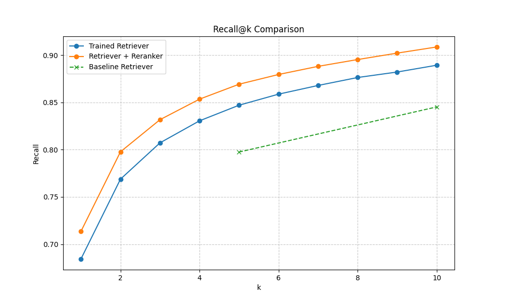
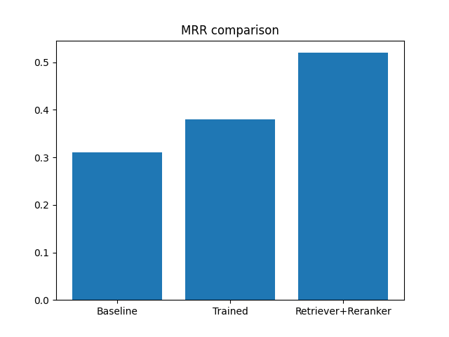
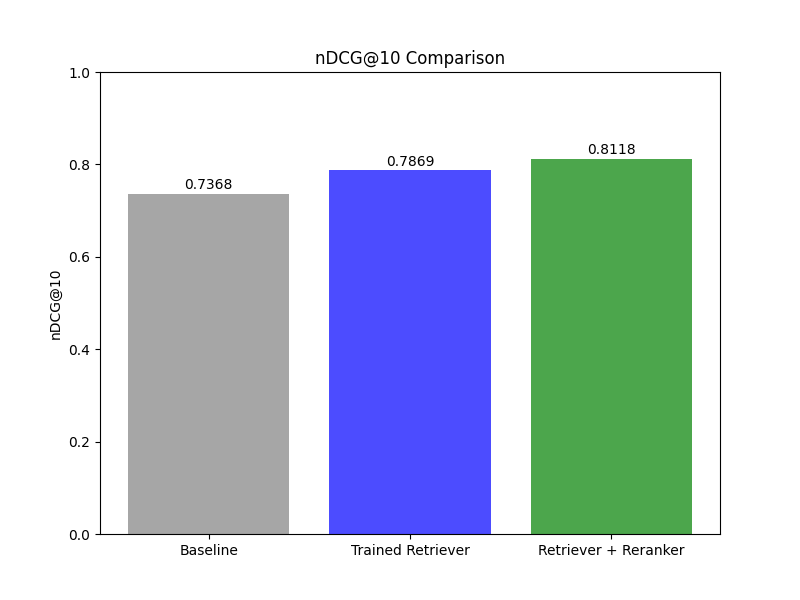

# Two-Stage Information Retrieval System

Двухэтапная поисковая система: **Retrieve → Rerank** для польского языка.

## Задача

Построить IR-систему с двумя этапами:

1. **Retriever (bi-encoder)** — быстрый поиск кандидатов по эмбеддингам
2. **Reranker (cross-encoder)** — точное переранжирование top-k документов

## Датасет

**[WebFAQ Retrieval](https://huggingface.co/datasets/PaDaS-Lab/webfaq-retrieval)** — польский язык (`pol`)

| Компонент | Описание |
|-----------|----------|
| `corpus.jsonl` | Уникальные документы (ответы) |
| `queries.jsonl` | Вопросы |
| `train.jsonl` / `test.jsonl` | Аннотации релевантности |

## Архитектура проекта

```
project/
├── data/                    # Данные
├── models/                  # Обученные модели
├── src/
│   ├── retriever/           # Bi-encoder модели
│   │   └── baseline_retriever.py
│   ├── reranker/            # Cross-encoder модели
│   │   └── baseline_reranker.py
│   ├── utils/               # Утилиты
│   │   ├── model_interface.py    # Абстрактные интерфейсы
│   │   └── preprocessing.py       # Обработка текста
│   └── pipeline/            # Пайплайн поиска
│       └── base_pipeline.py
├── notebooks/
│   ├── data_exploration.ipynb    # Анализ данных
│   ├── integration.ipynb         # Интеграция моделей
│   └── report_plots.ipynb        # Графики для отчёта
├── images/                  # Графики
└── requirements.txt         # Зависимости
```

## Модели

### Baseline Retriever
- **Модель**: `paraphrase-multilingual-MiniLM-L12-v2`
- **Метод**: Bi-encoder + cosine similarity
- **Использование**: Первичный поиск top-k кандидатов

### Baseline Reranker
- **Модель**: `paraphrase-multilingual-MiniLM-L12-v2`
- **Метод**: Cosine similarity (placeholder)
- **Улучшение**: Cross-encoder (fine-tuned)

## Метрики

| Модель | Recall@5 | Recall@10 | Recall@20 | MRR | nDCG@10 |
|--------|----------|-----------|-----------|-----|---------|
| Baseline Retriever | — | — | — | — | — |
| Trained Retriever | — | — | — | — | — |
| Retriever + Reranker | — | — | — | — | — |

> Метрики будут добавлены после обучения моделей.

## Установка

```bash
pip install -r requirements.txt
```

## Использование

```python
from src.retriever.baseline_retriever import BaselineRetriever
from src.reranker.baseline_reranker import BaselineReranker
from src.pipeline.base_pipeline import BasePipeline

# Инициализация
retriever = BaselineRetriever()
reranker = BaselineReranker()
pipeline = BasePipeline(retriever, reranker)

# Индексация корпуса
corpus = [{"doc_id": "1", "text": "..."}, ...]
retriever.index_corpus(corpus)

# Поиск
results = pipeline.search("Jaka jest stolica Polski?", top_k_retrieve=100, top_k_final=10)
```

## Результаты

### Recall@k Comparison


### MRR Comparison


### nDCG@10 Comparison


## Команда

| Участник | Роль |
|------|-----------------|
| Анастасия Бронина | Архитектура, baseline, интеграция |
| Софья Князева | Dense Retriever, FAISS, метрики |
| Александр Гусев | Cross-encoder Reranker, обучение |
